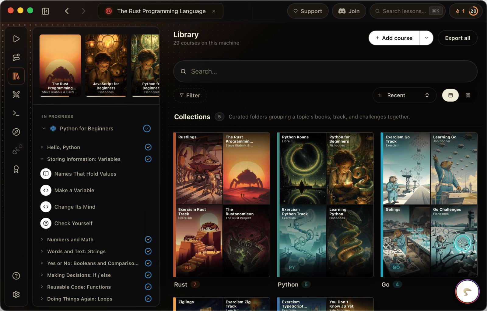
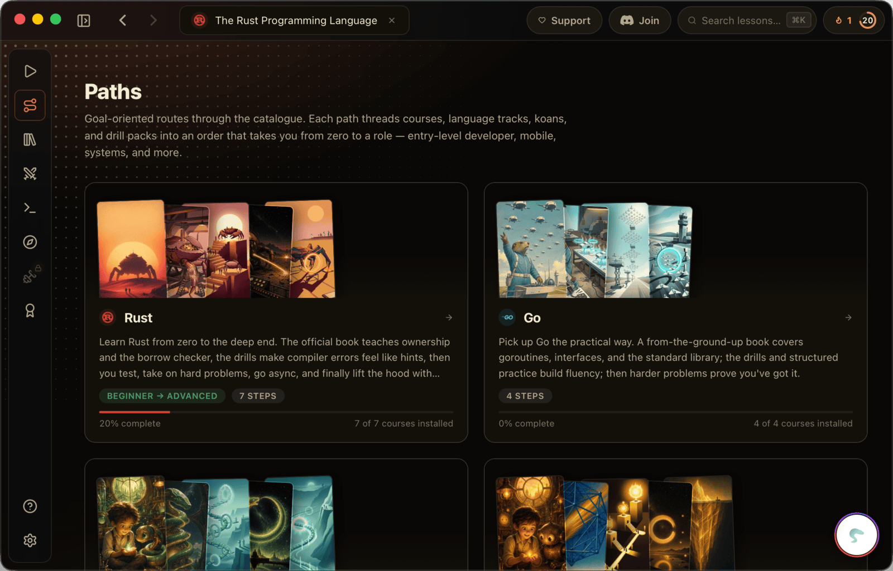

<div align="center">


# Libre

**Learn to code through books and guided exercises.**
Read a lesson, write code in a real editor, pass hidden tests. All in a
local-first desktop app with a vintage sci-fi soul.

<p align="center">
  <a href="https://libre.academy"></a>
  <a href="https://libre.academy/download"></a>
  
</p>

<p align="center">
  
  
  
  
  
</p>

[**🌐 libre.academy**](https://libre.academy) · [**⬇ Download**](https://libre.academy/download)

</div>

---

## 📸 Inside the app

<table>
  <tr>
    <td width="33%" valign="top">
      <br>
      <sub>📚 <b>Library</b>: courses grouped into collections</sub>
    </td>
    <td width="33%" valign="top">
      <br>
      <sub>🧭 <b>Paths</b>: guided routes from zero to a role</sub>
    </td>
    <td width="33%" valign="top">
      <br>
      <sub>📝 <b>Lessons</b>: prose, a real editor &amp; hidden tests</sub>
    </td>
  </tr>
</table>

## 🧩 What it does


Libre turns any technical book or doc site into a guided, hands-on course. Read a
short lesson, then write real code in a **Monaco** editor right beside it. Hit
**Run** and hidden tests grade your work the way an interview screen does.
Execution is hybrid: in-browser sandboxes first, with a native subprocess
fallback when a real toolchain is needed. A local **AI tutor** reads the lesson,
your code, and the tests, defaulting to a local Ollama model, so there are no
API keys or usage bills.

<br clear="left" />

- 📖 **Books → courses**: any book or doc site becomes hands-on.
- ✅ **Hidden-test grading**: pass-or-fail, like a real interview screen.
- 📦 **`.libre` archives**: export and share whole courses (legacy `.kata` imports).
- 🔒 **Local-first**: progress stays on your machine; cloud sync is opt-in.

## 🖥 Desktop &amp; browser


The desktop build is a **Tauri 2** shell for **macOS + Windows**: native
runtimes, file ingest, and full offline use, with phone and watch companions
planned. Don't want to install? The very same app runs in your browser at
**[libre.academy/learn](https://libre.academy/learn)**. No download, same
courses, same progress.

<br clear="right" />

## 🛠 Stack

| | |
|---|---|
| 🦀 **Tauri 2** | native shell (macOS + Windows; phone + watch companions planned) |
| ⚛️ **React 19 + Vite + TypeScript** | frontend |
| 🎚 **[`@mattmattmattmatt/base`](../../Libs/base)** | monochrome glass UI kit (local `file:` link) |
| ⌨️ **Monaco** | code editor |
| 🎨 **Shiki** | syntax highlighting for reading (via base) |
| 🧪 **Vitest** | tests |

**Languages (V1):** JavaScript/TypeScript · Python · Rust · Swift.

## 🚀 Run

```bash
npm install
npm run tauri:dev     # full app (native shell)
npm run dev           # frontend only (no Tauri shell)
npm run test          # vitest
```

## 🗂 Layout

```
libre/
├── src/                 # React frontend
│   ├── components/      # Sidebar · TabBar · Lesson · Editor · Output
│   ├── data/            # types + seed courses
│   └── App.tsx
├── src-tauri/           # Rust Tauri backend
└── .github/assets/      # README artwork (shared with the web version)
```

## 📄 License

**MIT.** The desktop app, the [marketing site](https://libre.academy), and the
cloud-sync server are all open source.

<div align="center"><sub>Made with caffeine, monsters, and robots. 🦖🤖</sub></div>
